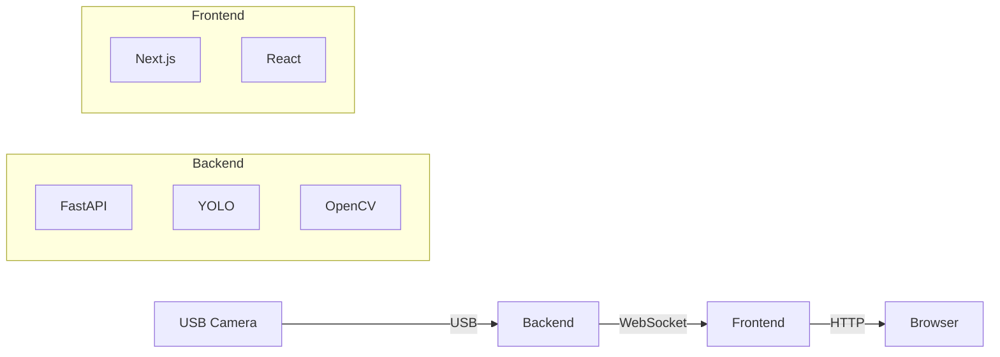

# Creating Architecture Diagram

The README references `docs/architecture.png`. Here's how to create it.

## Option 1: Quick ASCII Version (Already Done)

The README currently has a text-based architecture diagram. This works perfectly for documentation and doesn't require any image files.

If you want to keep it simple, the current ASCII diagram in the README is sufficient.

---

## Option 2: Create Professional Diagram

### Tools You Can Use

#### A. draw.io (Recommended - Free & Easy)

1. **Go to:** https://app.diagrams.net/
2. **Create new diagram**
3. **Use these components:**
   ```
   - Rectangles for: Camera, Backend, Frontend, NPU
   - Arrows for: Data flow
   - Icons from: Icon library (search for camera, server, etc.)
   ```

4. **Suggested layout:**
   ```
   [Camera] --USB--> [Backend Container]
                     ├─ FastAPI
                     ├─ YOLO
                     ├─ OpenCV
                     └─ NPU (for ARM)
                           │
                           │ WebSocket
                           ▼
                     [Frontend Container]
                     ├─ Next.js
                     ├─ React
                     └─ Dashboard
                           │
                           │ HTTP
                           ▼
                     [Browser: localhost:3000]
   ```

5. **Export as PNG:**
   - File → Export as → PNG
   - Name: `architecture.png`
   - Save to: `/Users/wlin/dev/pipeline-inspection/docs/`

#### B. Excalidraw (Free, Hand-drawn Style)

1. **Go to:** https://excalidraw.com/
2. Create hand-drawn style diagram
3. Export as PNG
4. Save to `docs/architecture.png`

#### C. Lucidchart (Professional)

1. **Go to:** https://www.lucidchart.com/
2. Use professional templates
3. Export high-res PNG

#### D. Python Code (Automated)

Create diagram using Python:

```python
# Install: pip install diagrams
from diagrams import Diagram, Cluster, Edge
from diagrams.onprem.compute import Server
from diagrams.onprem.client import Client
from diagrams.custom import Custom

with Diagram("Pipeline Inspection System",
             filename="docs/architecture",
             show=False,
             direction="LR"):

    camera = Custom("USB Camera", "./icons/camera.png")

    with Cluster("Backend"):
        backend = [
            Server("FastAPI"),
            Server("YOLO"),
            Server("OpenCV"),
        ]

    with Cluster("Frontend"):
        frontend = Client("Next.js Dashboard")

    browser = Client("Browser\nlocalhost:3000")

    camera >> Edge(label="USB") >> backend
    backend >> Edge(label="WebSocket") >> frontend
    frontend >> Edge(label="HTTP") >> browser
```

Run: `python create_diagram.py`

---

## Option 3: Use Mermaid (Markdown Diagrams)

Add this to README instead of PNG:

````markdown

````

**Note:** GitHub and many markdown viewers support Mermaid automatically.

---

## Quick Solution (No Image Needed)

### Update README to remove PNG reference:

Replace this line in README.md:
```markdown

```

With:
```markdown
See [Architecture Documentation](docs/ARCHITECTURE.md) for detailed diagrams.
```

This way, you don't need an image file at all - the architecture is documented in `docs/ARCHITECTURE.md` with ASCII diagrams.

---

## Recommended Approach

For a **professional presentation**:

1. **Use draw.io** (5-10 minutes)
   - Free, professional-looking
   - Easy drag-and-drop
   - Export high-quality PNG

2. **Quick diagram outline:**
   ```
   ┌──────────────┐
   │ USB Camera   │
   └──────┬───────┘
          │ USB
          ▼
   ┌──────────────────────────┐
   │      HOST DEVICE         │
   │  ┌─────────────────────┐ │
   │  │     Backend         │ │
   │  │  • FastAPI          │ │
   │  │  • YOLO             │ │
   │  │  • OpenCV           │ │
   │  │  • TFLite/NPU       │ │
   │  └──────┬──────────────┘ │
   │         │ WebSocket      │
   │         ▼                │
   │  ┌─────────────────────┐ │
   │  │     Frontend        │ │
   │  │  • Next.js          │ │
   │  │  • React            │ │
   │  │  • Dashboard        │ │
   │  └─────────────────────┘ │
   └──────────────────────────┘
          │ HTTP
          ▼
   ┌──────────────┐
   │   Browser    │
   │ localhost:3000│
   └──────────────┘
   ```

3. **Save as:** `docs/architecture.png`

---

## For Now (Temporary Solution)

I've created comprehensive architecture documentation in:
- `docs/ARCHITECTURE.md` - Detailed diagrams and explanations

You can either:
1. **Keep it as is** - The ASCII diagrams work great
2. **Create PNG later** - Use draw.io when you need it for presentations
3. **Remove image reference** - Link to ARCHITECTURE.md instead

**Current status:** System works perfectly without the PNG image. The documentation is complete.

---

## Want me to create the diagram?

I can provide you with:
1. A Mermaid diagram (works in GitHub automatically)
2. Python code to generate PNG
3. Detailed draw.io instructions

Just let me know which you prefer!
